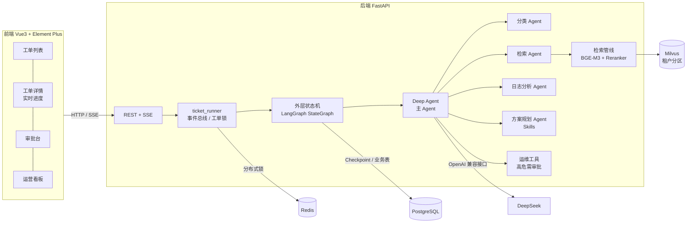
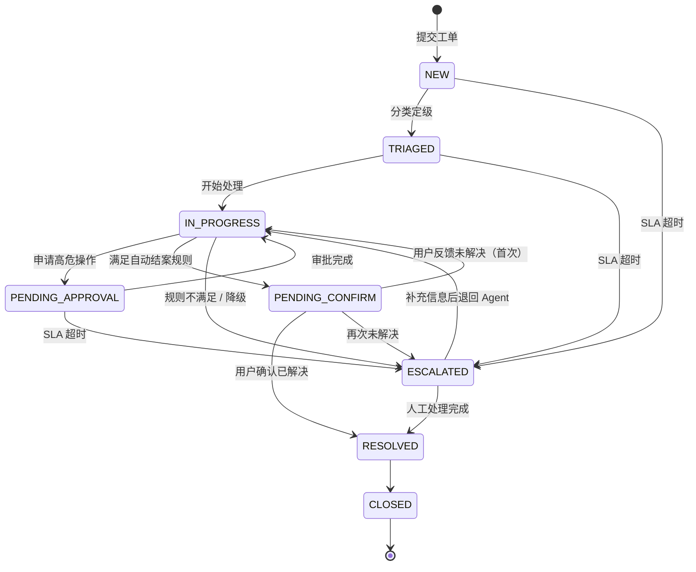
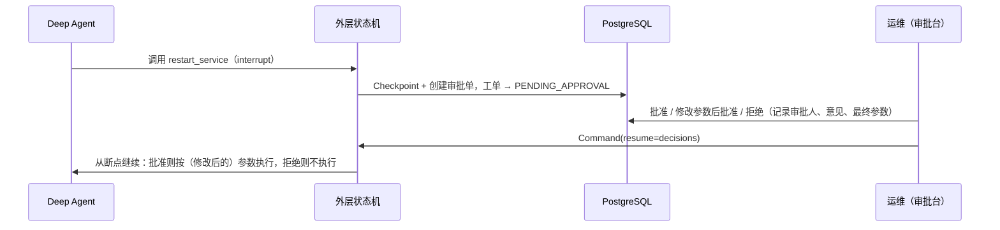

# IT 智能工单系统（IT Ticket Agent）

基于 **LangChain Deep Agents + LangGraph** 的企业 IT 服务台工单自动处理系统。

员工提交 IT 故障工单后，由**外层状态机**驱动一个 Deep Agent 完成诊断。主 Agent 负责规划并委派 4 个上下文隔离的子 Agent，分别做分类、知识检索、日志分析和方案规划，之后给出处理结论。高危运维操作必须经人工审批才会执行；是否能自动结案由代码规则判定，不交给模型决定。处理全过程通过 SSE 实时推送到前端。

> 本项目是一个完整可运行的工程样例：状态机、审批、检索、多租户、降级、断点恢复都有真实实现和测试覆盖。
> 运维操作（重启服务、重置密码等）由**模拟执行器**完成，工单与知识库数据为按模板生成的模拟数据，详见[已知限制](#已知限制)。

---

## 目录

- [核心特性](#核心特性)
- [系统架构](#系统架构)
- [工单状态机](#工单状态机)
- [Deep Agent 设计](#deep-agent-设计)
- [知识检索](#知识检索)
- [高危操作审批](#高危操作审批human-in-the-loop)
- [可靠性设计](#可靠性设计)
- [技术栈](#技术栈)
- [目录结构](#目录结构)
- [快速开始](#快速开始)
- [演示账号与体验流程](#演示账号与体验流程)
- [API 概览](#api-概览)
- [测试](#测试)
- [离线评测](#离线评测)
- [配置说明](#配置说明)
- [已知限制](#已知限制)

---

## 核心特性

| 能力 | 实现 |
|---|---|
| 多 Agent 协作 | 主 Agent + 4 个子 Agent（分类 / 检索 / 日志分析 / 方案规划），子 Agent 上下文隔离，并行委派 |
| 外层状态机 | 8 种状态、流转白名单、每次流转落库审计；模型只提供数据，不决定流转 |
| 自动结案规则 | 检索置信度 ≥ 0.6 且结论置信度 ≥ 0.7 才进入"待用户确认"，否则转人工 |
| 检索增强 | Query 策略分类（精确 / 模糊 / 多问题）→ HyDE / Multi-Query → BGE-M3 稠密 + 稀疏混合召回 → BGE-Reranker 精排 |
| Skills | 5 个标准处理流程（SKILL.md），方案规划 Agent 按需读取，文件系统权限设为只读 |
| 高危审批 | `restart_service` / `reset_password` / `grant_permission` 触发 LangGraph interrupt，支持批准、修改参数后批准、拒绝，全程留痕 |
| 实时进度 | SSE 推送状态变化、Agent 计划（todos）、子 Agent 委派与返回、工具调用 |
| SLA | P1~P4 对应 30 分钟 ~ 24 小时时限，后台巡检超时自动升级（分布式锁防多实例重复执行） |
| 三层降级 | 模型调用重试 → 仅检索参考方案并转人工 → 系统兜底转人工，流程不中断 |
| 断点恢复 | LangGraph PostgreSQL Checkpoint，等待审批期间服务重启，恢复后从断点继续 |
| 多租户 | 业务数据按 `tenant_id` 隔离；Milvus 以 `tenant_id` 为 Partition Key，检索强制过滤 |
| 并发安全 | Redis 分布式锁保证同一工单同一时刻只有一个处理流程；状态流转行级锁 |

---

## 系统架构



**分层职责**

- **外层状态机**（`backend/agents/ticket/workflow.py`）：管理工单生命周期。它负责启动 Agent、按规则判定能否自动结案、等待用户确认或人工处理、控制重新处理的次数、执行降级。每一步都写入 Checkpoint。
- **Deep Agent**（`backend/agents/ticket/agent.py`）：负责单次诊断，内容包括规划、委派子 Agent、执行运维操作、提交结论。它作为子图运行在外层状态机的一个节点里，高危工具产生的 interrupt 会冒泡到外层，由审批接口恢复执行。
- **ticket_runner**（`backend/services/ticket_runner.py`）：在后台运行流程图，把流式事件翻译成前端进度事件，并用分布式锁防止同一工单被并发处理。

---

## 工单状态机



| 状态 | 含义 |
|---|---|
| `NEW` | 新建 |
| `TRIAGED` | 已分类（类别、优先级、SLA 截止时间已确定） |
| `IN_PROGRESS` | Agent 处理中 |
| `PENDING_APPROVAL` | 高危操作等待运维审批 |
| `PENDING_CONFIRM` | Agent 已给出方案，等待提单人确认 |
| `RESOLVED` | 已解决 |
| `CLOSED` | 已关闭 |
| `ESCALATED` | 已升级，转人工处理 |

**转人工规则**（`workflow._escalation_reason`，按顺序判定）：

1. 系统降级（第三层）→ 转人工
2. Agent 失败但检索到参考方案（第二层）→ 附上参考方案后转人工
3. Agent 未提交结论 → 转人工（先尝试强制补交一次结论）
4. Agent 判定无法自动解决 → 转人工
5. 结论置信度 < 0.7 → 转人工
6. 检索置信度 < 0.6（由 Reranker 分数计算，不采用模型自评）→ 转人工

用户确认"未解决"时，Agent 会带着用户反馈重新诊断一次；第二次仍未解决则转人工。

---

## Deep Agent 设计

### 主 Agent 与子 Agent

| Agent | 职责 | 工具 |
|---|---|---|
| 主 Agent `ticket-agent` | 规划（write_todos）、并行委派、执行运维操作、提交分类和结论 | `submit_triage` `submit_resolution` `check_service_status` 及运维工具 |
| `ticket-classifier` | 分类定级，只输出 JSON | 无 |
| `kb-researcher` | 检索运维手册和相似历史工单 | `search_knowledge_base` `search_similar_tickets` |
| `log-analyst` | 查日志、服务状态、账号状态，定位根因 | `query_system_logs` `check_service_status` `get_user_account` |
| `solution-planner` | 读取 Skills 标准流程，给出处理方案 | Skills（`/skills/` 只读） |

主 Agent 按轮次工作：

1. 列出处理计划，同时并行委派分类、检索、日志分析三个子 Agent。
2. 提交分类结果，同时委派方案规划子 Agent。
3. 按方案执行运维操作。
4. 提交结论。

子 Agent 看不到主 Agent 的上下文，只接收委派描述，返回的结论有字数上限，以免主 Agent 的上下文膨胀。

### 运维工具与风险分级

| 工具 | 风险 | 说明 |
|---|---|---|
| `unlock_account` | 低 | 解锁域账号，直接执行 |
| `clear_print_queue` | 低 | 清空打印队列，直接执行 |
| `restart_service` | **高** | 重启服务，需审批 |
| `reset_password` | **高** | 重置域密码，需审批 |
| `grant_permission` | **高** | 授予权限（read / write / admin），需审批 |

### Skills

`backend/agents/ticket/skills/` 下有 5 个标准处理流程：`password-reset`、`vpn-troubleshooting`、`printer-issues`、`email-issues`、`permission-request`。它们通过 `CompositeBackend` 挂载到虚拟路径 `/skills/`，并用 `FilesystemPermission` 禁止写入。

---

## 知识检索

```text
工单描述
  └─ 策略分类（规则快判，边界情况用 LLM 判定）
       ├─ PRECISE  描述具体          → 原文检索
       ├─ VAGUE    描述笼统          → HyDE：先生成假设性故障说明再检索
       └─ BROAD    一张工单多个问题  → Multi-Query：拆分子查询并行检索、合并去重
  └─ BGE-M3 稠密 + 稀疏向量混合召回（Milvus，按租户分区过滤）
  └─ BGE-Reranker 精排，Top-1 分数作为检索置信度
```

- 知识库包含两类文档：运维手册 `runbook`（按二级标题切块）和历史工单 `ticket`（每条一块，包含现象、根因、处理过程）。
- 每次检索的查询、命中文档和置信度都写入 `ticket_retrievals` 表，工单详情页可查看。
- 深圳分公司租户额外拥有一份《深圳分公司网络》手册，可以用来直观验证租户间的知识库隔离。

---

## 高危操作审批（Human-in-the-Loop）



- 基于 Deep Agents 的 `interrupt_on`（HumanInTheLoopMiddleware）实现，审批之前工具**不会被执行**。
- 同一次中断里的多个高危操作必须全部给出决定才能提交；审批单按 interrupt_id 幂等创建。
- 审批记录（`ticket_approvals`）和运维操作日志（`ops_actions`）永久保留，可审计。
- 统计处理耗时时，已扣除等待审批的时间。

---

## 可靠性设计

**三层降级**（`backend/core/retry.py`）

| 层级 | 触发 | 行为 |
|---|---|---|
| 第一层 | 模型调用失败 | `ModelRetryMiddleware` 按 1s / 3s 退避重试；检索调用由 `@with_retry` 重试 |
| 第二层 | 重试耗尽 | 只做知识检索，把参考方案附到工单上转人工 |
| 第三层 | 检索也不可用 | 系统兜底，直接转人工 |

**其他**

- **断点恢复**：外层状态机和 Deep Agent 子图共用 `AsyncPostgresSaver`，线程 ID 为 `ticket-{id}`。服务重启后，挂起的审批和确认都能按原 interrupt 恢复（有测试覆盖）。
- **工单锁**：`ticket:{id}` 分布式锁（Redis，不可用时退化为进程内锁），重复触发返回 409。
- **SLA 巡检**：后台任务定时扫描超时工单并升级，通过 `sla:scanner` 锁保证多实例下只执行一次。
- **本地模型线程安全**：BGE-M3 和 Reranker 的加载与推理固定在单线程执行器中，避免并发加载原生库导致进程崩溃。

---

## 技术栈

| 层 | 技术 |
|---|---|
| Agent | deepagents 0.7、LangGraph 1.2、LangChain 1.4 |
| 大模型 | DeepSeek（OpenAI 兼容接口，默认 `deepseek-v4-flash`，关闭思考模式） |
| 检索 | BGE-M3（稠密 + 稀疏）、BGE-Reranker-Large、Milvus 2.4 |
| 后端 | FastAPI、SQLAlchemy（asyncpg）、psycopg 3、Redis |
| 存储 | PostgreSQL 15（业务表 + LangGraph Checkpoint） |
| 前端 | Vue 3、TypeScript、Vite 5、Element Plus、Pinia |
| 工程 | uv、pytest / pytest-asyncio、Docker Compose |

---

## 目录结构

```text
.
├── backend/
│   ├── agents/ticket/
│   │   ├── workflow.py        # 外层状态机：start_run → run_agent → finalize → 确认 / 人工
│   │   ├── agent.py           # Deep Agent：主 Agent + 4 个子 Agent + interrupt_on
│   │   ├── prompts.py         # 各 Agent 的系统提示词
│   │   ├── tools.py           # 业务工具（检索、诊断、运维、提交分类 / 结论）
│   │   ├── retrieval.py       # 策略化检索 + 混合召回 + 精排
│   │   ├── states.py          # 8 种状态、流转白名单、SLA 策略
│   │   ├── mock_ops.py        # 模拟运维环境（日志 / 服务 / 账号，按场景保持状态一致）
│   │   └── skills/            # 5 个 SKILL.md 标准处理流程
│   ├── api/v1/                # auth / tickets（含 SSE、审批）/ stats
│   ├── services/              # ticket_repo、ticket_runner、approvals、sla、locks
│   ├── core/                  # llm_factory、knowledge_base、reranker、checkpointer、retry、logger
│   ├── db/migrations.py       # 启动时幂等执行的建表 / 补丁
│   └── main.py                # FastAPI 应用与生命周期（迁移、Checkpoint、模型预热、SLA 巡检）
├── frontend/src/
│   ├── views/                 # 工单列表、工单详情、审批台、运营看板、登录
│   ├── components/ticket/     # AgentProgress（实时进度）、ApprovalCard（审批卡片）
│   └── composables/useTicketStream.ts   # SSE 订阅
├── data/
│   ├── runbooks/              # 7 份运维手册（各租户通用）
│   ├── runbooks_branch/       # 深圳分公司专属手册
│   ├── scenarios.py           # 22 个故障场景模板（数据生成与评测的唯一来源）
│   ├── history_tickets.jsonl  # 200 条模拟历史工单（入知识库）
│   └── eval_tickets.jsonl     # 100 条评测工单
├── scripts/
│   ├── seed_data.py           # 演示账号
│   ├── init_milvus.py         # 创建 Milvus 集合（租户分区）
│   ├── build_knowledge_base.py# 构建知识库（幂等，按内容哈希增量）
│   ├── generate_datasets.py   # 由场景模板生成历史工单与评测集
│   ├── eval_tickets.py        # 离线评测
│   ├── reset_demo_tickets.py  # 清空演示工单
│   └── manual_tests/          # 连通性与性能排查脚本
├── tests/                     # pytest
├── docker-compose.yml         # PostgreSQL / Milvus（etcd + MinIO）/ Redis / Attu
├── .env.example
└── run.py                     # 后端启动入口
```

---

## 快速开始

### 1. 环境要求

- Python 3.11+，[uv](https://docs.astral.sh/uv/)
- Node.js 18+（开发时使用 20）
- Docker 与 Docker Compose
- DeepSeek API Key
- 内存建议 16 GB 以上（两个本地模型合计约 4.5 GB；有 NVIDIA GPU 时自动使用 CUDA）

### 2. 配置环境变量

```bash
cp .env.example .env.local
cp frontend/.env.example frontend/.env.local
```

编辑 `.env.local`，至少填写：

- `DEEPSEEK_API_KEY`
- `DB_PASSWORD`
- `JWT_SECRET_KEY`：可用 `python -c "import secrets; print(secrets.token_urlsafe(48))"` 生成

### 3. 启动基础设施

```bash
docker compose --env-file .env.local up -d
```

| 服务 | 本机端口 | 说明 |
|---|---|---|
| PostgreSQL | 5433 | 业务表 + Checkpoint；首次启动自动执行 `scripts/init_db.sql` |
| Milvus | 19531 | 向量库（依赖内部的 etcd、MinIO） |
| Redis | 6380 | 分布式锁 |
| Attu | 30000 | Milvus 可视化管理界面（可选） |

端口特意避开了默认端口，以免与本机已有的服务冲突，可在 `docker-compose.yml` 和 `.env.local` 中一起修改。

### 4. 安装后端依赖

```bash
uv sync
```

在国内网络环境下，可以指定镜像源：`uv sync --default-index https://pypi.tuna.tsinghua.edu.cn/simple`。

### 5. 下载本地模型

模型权重需要下载到 `backend/models/` 下（该目录已被 `.gitignore` 忽略）：

```bash
# HuggingFace（国内可先设置 HF_ENDPOINT=https://hf-mirror.com）
huggingface-cli download BAAI/bge-m3 --local-dir backend/models/embedding/bge-m3
huggingface-cli download BAAI/bge-reranker-large --local-dir backend/models/reranker/bge-reranker-large

# 或 ModelScope
modelscope download --model BAAI/bge-m3 --local_dir backend/models/embedding/bge-m3
modelscope download --model BAAI/bge-reranker-large --local_dir backend/models/reranker/bge-reranker-large
```

### 6. 初始化数据

```bash
uv run python scripts/seed_data.py             # 演示账号（23 个）
uv run python scripts/init_milvus.py           # 创建向量集合（会清空已有集合）
uv run python scripts/build_knowledge_base.py  # 运维手册 + 历史工单入库，首次需几分钟
```

`data/` 下已经包含生成好的数据集。修改 `data/scenarios.py` 后，需要依次执行 `scripts/generate_datasets.py` 和 `build_knowledge_base.py --rebuild`。

### 7. 启动后端

```bash
uv run python run.py
```

启动时会自动执行数据库迁移、初始化 Checkpoint、预热本地模型（约 1 分钟），并启动 SLA 巡检。

- 接口文档：http://localhost:8000/docs
- 健康检查：http://localhost:8000/health

> Windows 下必须用 `run.py` 启动，不能直接用 `uvicorn` 命令：psycopg 异步连接不支持 Windows 默认的 Proactor 事件循环，`run.py` 会改用 Selector 事件循环。

### 8. 启动前端

```bash
cd frontend
npm install
npm run dev
```

打开 http://localhost:3000 。开发服务器会把 `/api` 请求代理到 `127.0.0.1:8000`。

---

## 演示账号与体验流程

所有演示账号的密码均为 `Passw0rd!`（仅用于本地演示，部署前请修改 `scripts/seed_data.py`）。

| 租户 | 账号 | 角色 | 权限 |
|---|---|---|---|
| 集团总部 `it_hq` | `admin` | 管理员 | 同运维 |
| | `ops_wang` | 运维 | 查看本租户全部工单、审批、人工处理、运营看板 |
| | `zhangsan` `lisi` `wangwu` 等 10 个 | 提单人 | 提交工单、查看自己的工单、确认处理结果 |
| 深圳分公司 `it_branch` | `ops_chen` | 运维 | 同上，仅限本租户 |
| | `sz_zhangsan` 等 10 个 | 提单人 | 同上 |

**建议的体验路径**（建议用两个浏览器窗口分别登录提单人和运维）：

| 场景 | 工单示例 | 预期 |
|---|---|---|
| 低风险自动处理 | 账号被锁定：登录电脑提示账户已被锁定 | Agent 查到账号锁定 → 直接解锁 → 待用户确认 |
| 高危审批 | 密码过期登录不了：开机提示密码已过期 | Agent 申请重置密码 → 运维在审批台批准 / 修改 / 拒绝 |
| 高危审批 | 我们部门好几个人 VPN 都连不上，提示无法分配地址 | Agent 申请重启 VPN 网关 |
| 重新处理 | 邮箱满了：Outlook 提示邮箱容量已满 | 用户点"没解决" → Agent 重新诊断；再次未解决 → 转人工 |
| 必须转人工 | 申请本地管理员权限 | 按服务台规范直接转人工，运维填写结果结案或退回 Agent |
| 租户隔离 | 用 `ops_chen` 登录 | 看不到总部的任何工单 |

---

## API 概览

完整接口文档见 `/docs`（OpenAPI）。

| 方法 | 路径 | 角色 | 说明 |
|---|---|---|---|
| POST | `/api/v1/auth/login` | 公开 | 登录，返回 JWT |
| POST | `/api/v1/tickets` | 登录用户 | 提交工单（默认自动交给 Agent 处理） |
| GET | `/api/v1/tickets` | 登录用户 | 工单列表（提单人只能看到自己的） |
| GET | `/api/v1/tickets/{id}` | 登录用户 | 详情：工单、流转记录、审批、运维操作、检索记录、当前挂起的步骤 |
| POST | `/api/v1/tickets/{id}/run` | 登录用户 | 手动交给 Agent 处理 |
| GET | `/api/v1/tickets/{id}/stream` | 登录用户 | SSE 实时进度 |
| POST | `/api/v1/tickets/{id}/confirm` | 提单人（运维可代为确认） | 确认已解决 / 未解决 |
| POST | `/api/v1/tickets/{id}/approvals` | 运维 | 提交审批决定 |
| POST | `/api/v1/tickets/{id}/resolve` | 运维 | 人工结案或退回 Agent |
| GET | `/api/v1/approvals` | 运维 | 待审批 / 审批记录 |
| GET | `/api/v1/stats` | 运维 | 运营指标（自动解决率、转人工率、审批率、降级率、耗时 P50 / P95） |

**SSE 事件类型**：`status` `stage` `todos` `subagent_start` `subagent_result` `tool_call` `tool_result` `agent_message` `awaiting` `error` `done`

---

## 测试

```bash
uv run pytest -q
```

测试依赖本地 PostgreSQL（`docker compose up -d postgres`），不依赖大模型和 Milvus。每次测试会话使用随机的测试租户，结束后自动清理。Agent 部分使用桩实现或脚本化模型，测的是真实的业务工具、状态机和 Deep Agent 中间件。

| 文件 | 覆盖 |
|---|---|
| `test_states.py` | 全部合法 / 非法状态流转、SLA 计算 |
| `test_ticket_repo.py` | 流转审计、并发行锁、字段白名单、租户隔离、审批幂等、SLA 巡检、延迟统计 |
| `test_workflow.py` | 自动解决、各转人工规则、审批批准 / 修改 / 拒绝、重新处理、二三级降级、SLA 升级、补交结论、PostgreSQL Checkpoint 重启恢复 |
| `test_deep_agent_hitl.py` | 真实 `create_deep_agent` + `interrupt_on`：审批前不执行、三种决定、低风险工具免审批、Skills 只读 |
| `test_api.py` | 鉴权、角色权限、跨租户 404、完整处理流程、SSE、审批台、统计、同名账号登录 |
| `test_retry.py` `test_locks.py` `test_tenant_isolation_filter.py` | 重试与降级、Redis / 本地锁、Milvus 租户过滤表达式 |

---

## 离线评测

```bash
uv run python scripts/eval_tickets.py --concurrency 4          # 全量 100 条
uv run python scripts/eval_tickets.py --limit 5                # 冒烟
```

评测脚本把每条评测工单当作真实工单，完整跑一遍流程，并模拟人的操作：

- 审批：全部批准，admin 权限申请除外（拒绝）。
- 用户确认：按期望结果回答。
- 转人工的工单：由人工结案。

结果写入 `data/eval_results/`，统计的指标包括：

- 自动解决率、判断准确率、自动结案精确率 / 召回率
- 分类 / 优先级准确率、期望工具命中率
- 降级率、耗时 P50 / P95

评测集共 100 条，由 22 个场景各取 2 条未进入知识库的留出说法生成。其中 80 条期望自动解决，20 条期望转人工；10 条属于深圳分公司租户。

**一次全量评测的实测结果**（DeepSeek v4-flash，并发 4）：

| 指标 | 结果 |
|---|---|
| 自动解决率 | 66% |
| 判断准确率（自动 / 转人工） | 86% |
| 自动结案精确率 | 100%（没有把应转人工的工单自动结案） |
| 应转人工召回率 | 100% |
| 分类准确率 | 96% |
| 期望工具命中率 | 97.6% |
| 降级率 | 0%（未注入故障） |
| 单次处理耗时 P50 / P95 | 33.6s / 51.9s |

> 这次评测完成后，又调整了主 Agent 对"自助解决"的判定说明、增加了结论补交机制，并按服务台规范修正了 5 个场景的优先级标注；调整后未重新做全量评测。数据为模拟数据，结果只用于说明系统行为，不代表生产环境表现。

---

## 配置说明

主要配置项（完整列表见 `.env.example` 和 `backend/config.py`）：

| 变量 | 默认值 | 说明 |
|---|---|---|
| `DEEPSEEK_API_KEY` | — | 必填 |
| `JWT_SECRET_KEY` | — | 必填 |
| `DB_*` | `localhost:5433/it_ticket` | PostgreSQL 连接 |
| `MILVUS_HOST` / `MILVUS_PORT` | `localhost:19531` | Milvus 连接 |
| `REDIS_URL` | `redis://localhost:6380/0` | 不可用时退化为进程内锁 |
| `RETRIEVAL_CONFIDENCE_THRESHOLD` | `0.6` | 检索置信度低于此值转人工 |
| `RESOLUTION_CONFIDENCE_THRESHOLD` | `0.7` | 结论置信度低于此值转人工 |
| `SLA_SCAN_INTERVAL_SECONDS` | `60` | SLA 巡检间隔 |
| `BGE_M3_MODEL_PATH` / `RERANKER_MODEL_PATH` | `models/...` | 相对 `backend/` 目录 |

模型路由在 `backend/core/llm_factory.py` 的 `_AGENT_MODEL_ROUTING` 中配置，可以为主 Agent、子 Agent、检索改写分别指定模型。

---

## 已知限制

- **运维操作为模拟执行**：`mock_ops.py` 根据工单内容构造一个前后一致的模拟环境（日志、服务状态、账号状态），执行操作后状态会相应变化，但不会连接真实的 AD、邮件、VPN 系统。要接入真实系统，替换 `tools.py` 里的执行函数即可，审批和审计链路不需要改动。
- **数据为模拟数据**：运维手册、历史工单和评测集都由 `data/scenarios.py` 的模板生成。
- **延迟**：一次处理包含多轮模型调用（规划、3 个并行子 Agent、方案规划、执行、结论），单次耗时约 30~50 秒；Reranker 在 CPU 上运行时也会增加延迟。
- **SSE 事件总线在进程内**：多实例部署时，需要把 `ticket_runner` 的事件总线换成 Redis Pub/Sub。
